# Uira

**Uira – Where memories play.**

## 🖼 Screenshots

### 📱 Introduction Screen

  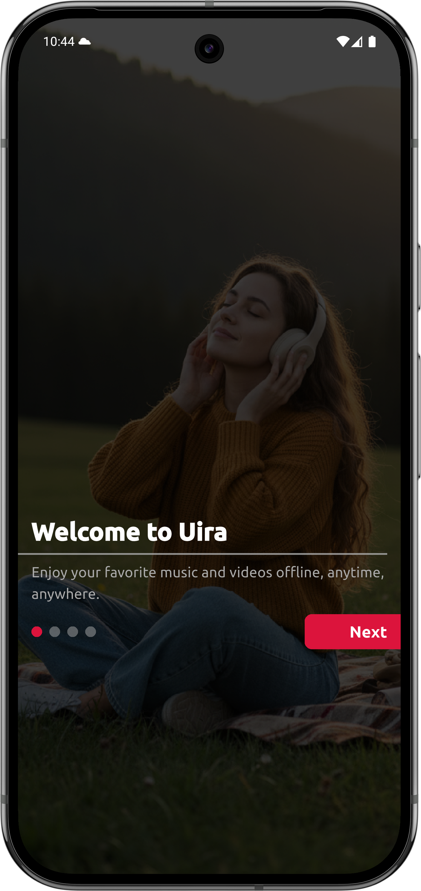&nbsp;&nbsp;&nbsp;
  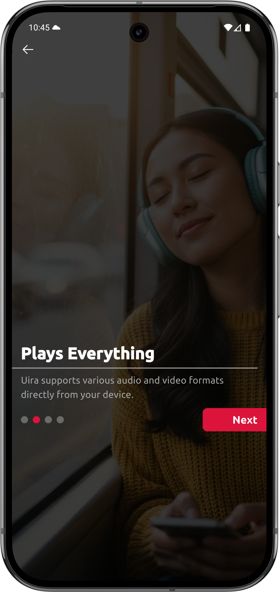&nbsp;&nbsp;&nbsp;
  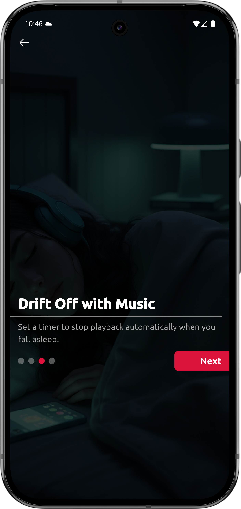&nbsp;&nbsp;&nbsp;
  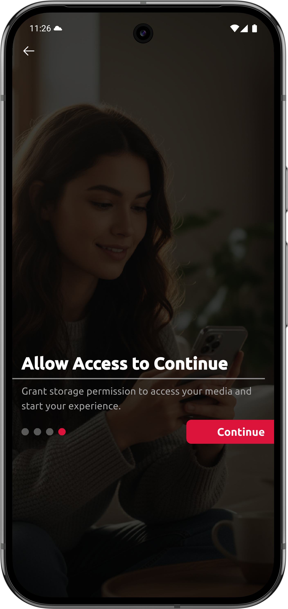

### 🏠 Home Screen

  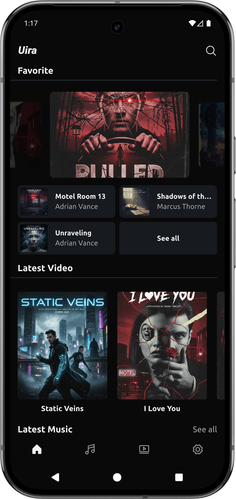&nbsp;&nbsp;&nbsp;
  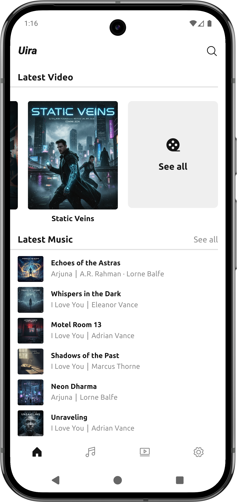

### 🎵 Music Screen 

  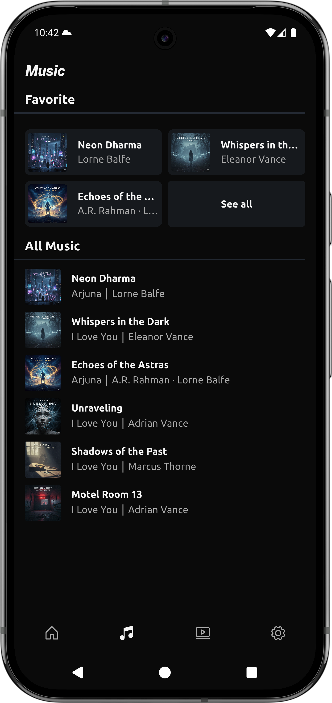&nbsp;&nbsp;&nbsp;
  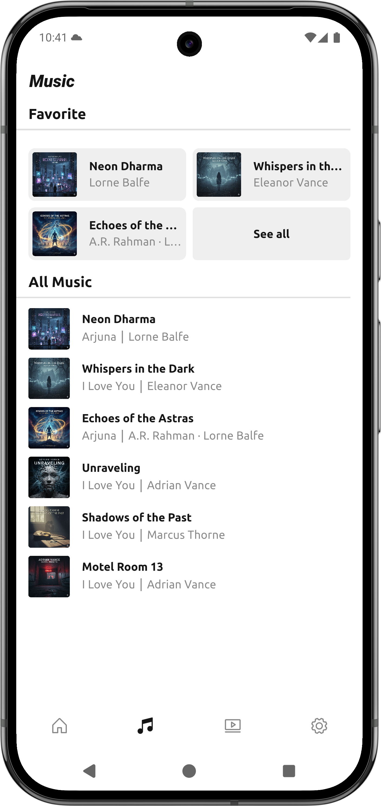&nbsp;&nbsp;&nbsp;
  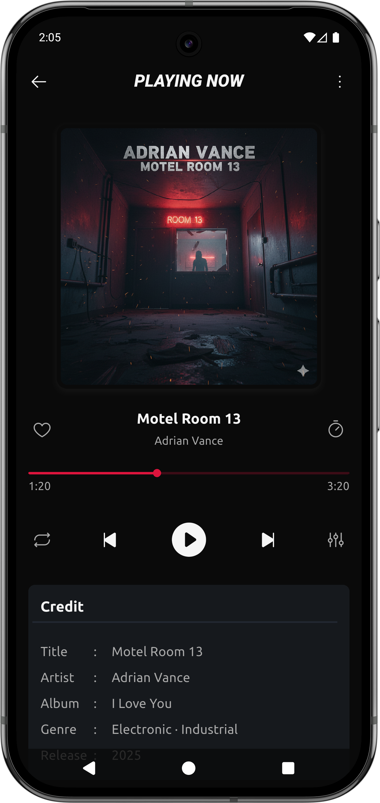&nbsp;&nbsp;&nbsp;
  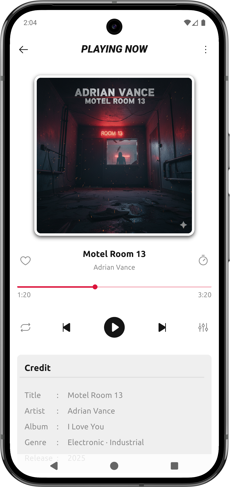

### 📽️ Video Screen

  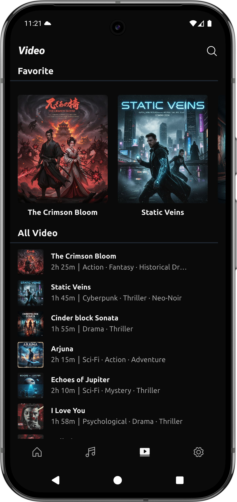&nbsp;&nbsp;&nbsp;
  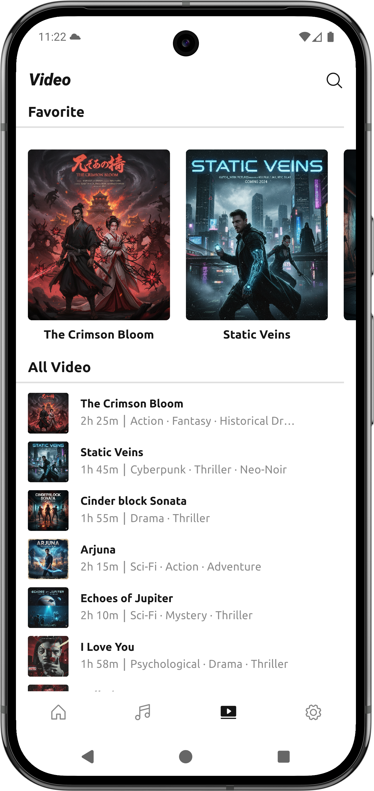

